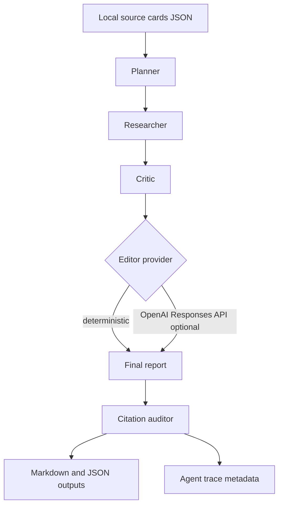

# Research Writer Agents

[](https://github.com/yuvkun10/research-writer-agents/actions/workflows/ci.yml)
[](./LICENSE)

Research Writer Agents is a TypeScript CLI and library that turns local source
cards into a cited research brief through a deterministic, multi-agent pipeline.
It is built for analysts, researchers, content strategists, and technical teams
who need repeatable draft generation with visible claim-to-source links instead
of an opaque one-shot prompt.

The default provider is **deterministic and network-free**, which keeps reports,
tests, and audits reproducible. When `OPENAI_API_KEY` is configured, the
pipeline can use the OpenAI Responses API for a single constrained editor pass
while preserving every claim ID and citation ID.

## Why this project

- **Traceable by design.** Every claim links to the source-card IDs that back
  it, and a citation auditor flags missing, unknown, or unused citations.
- **Reproducible by default.** The deterministic path never browses the web,
  calls a model, or sends source cards over the network, so the same input
  always produces the same report.
- **Optional model assist, safely bounded.** The OpenAI editor pass can polish
  prose but must preserve all claim and citation IDs, and it falls back to
  deterministic output if the key is missing or the call fails.
- **Small and inspectable.** A focused TypeScript codebase with one runtime
  dependency, full type coverage, and Vitest tests.

## Who it's for

- Analysts writing briefs from vetted notes, interviews, market scans, or
  internal research cards.
- Research operations teams that need claim-to-source mapping before a report
  reaches stakeholders.
- Content and editorial teams drafting citation-first explainers, white papers,
  or evidence-backed recommendations.
- Engineering and product teams converting decision logs, incident reviews, or
  customer evidence into concise research reports.
- Offline or privacy-sensitive drafting where source material stays local.

## Requirements

- Node.js `20.19` or newer
- npm `11` or newer

## Install

```bash
npm install
npm run build
```

For a clean, CI-style install use `npm ci`.

## Quick start

Create a local `sources.json` with at least one source card:

```json
[
  {
    "id": "source-1",
    "title": "Research Operations Notes",
    "excerpt": "Source cards make evidence visible across planning, drafting, and review."
  }
]
```

Generate a Markdown brief with the deterministic provider (no API key needed):

```bash
node --import tsx src/cli.ts \
  --topic "Citation-first research writing" \
  --sources ./sources.json \
  --out-dir ./out \
  --format markdown \
  --provider deterministic
```

This writes `./out/report.md` containing the plan, claims, report body, a
citation audit, and the rendered source cards.

## Using with coding agents / Codex

This repository ships an [`AGENTS.md`](./AGENTS.md) at its root following the
open-source AGENTS.md convention. It gives coding agents (such as OpenAI Codex
or Claude Code) the project overview, the five-agent pipeline contract, the
build/test/lint/typecheck commands, the repo layout, coding conventions, the
deterministic-vs-OpenAI provider rules, and the invariants they must not break —
most importantly that the OpenAI editor pass must preserve every claim ID and
citation ID. If you are pointing an agent at this repo, start it there.

## The pipeline

The pipeline runs five agents in order:

- `planner` — validates the topic and source cards, then creates report sections
  with source IDs attached to each section.
- `researcher` — converts selected local source cards into section-level
  research notes.
- `critic` — checks the draft for blocking editorial issues, including claims
  without source support.
- `editor` — applies either a deterministic edit or an optional OpenAI editor
  pass that must preserve claim IDs and citation IDs.
- `citation-auditor` — verifies that final claims cite known source cards and
  flags missing, unknown, or unused citations.



## Configuration

Copy `.env.example` to a local, git-ignored `.env` file when you want
environment configuration:

```bash
cp .env.example .env
```

`.env.example` contains only placeholders and safe defaults:

```bash
OPENAI_API_KEY=
OPENAI_MODEL=gpt-4.1-mini
RESEARCH_WRITER_PROVIDER=deterministic
```

Provider modes:

- `deterministic` — always run locally with no model call.
- `auto` — use OpenAI only when `OPENAI_API_KEY` is present; otherwise fall back
  to deterministic execution.
- `openai` — request the OpenAI editor pass and fall back to deterministic
  output if the key is missing or the provider call fails.

Do not commit `.env`, API keys, source-card files with private data, or
generated reports that contain confidential research.

## Source cards

Create a local JSON file containing either an array of source cards or an object
with a `sourceCards` array:

```json
[
  {
    "id": "source-1",
    "title": "Research Operations Notes",
    "author": "Example Team",
    "publishedAt": "2026-05-01",
    "url": "https://example.com/research-operations",
    "excerpt": "Source cards make evidence visible across planning, drafting, and review.",
    "notes": ["Optional analyst note."]
  }
]
```

Required fields are `id`, `title`, and `excerpt`. Optional fields are `author`,
`publishedAt`, `url`, and `notes`.

## CLI usage

Run from source during development:

```bash
node --import tsx src/cli.ts --topic "Citation-first research writing" --sources ./sources.json --out-dir ./out --format both --provider deterministic
```

Run after building:

```bash
node dist/cli.js --topic "Citation-first research writing" --sources ./sources.json --out-dir ./out --format both
```

Options:

- `--topic <topic>` — required report topic.
- `--sources <path>` — required path to local source-card JSON.
- `--out-dir <dir>` — output directory, defaults to the current directory.
- `--format markdown|json|both` — export format, defaults to `markdown`.
- `--provider auto|deterministic|openai` — provider mode, defaults to `auto`.
- `--model <model>` — optional OpenAI model override.

## Library usage

```ts
import { renderMarkdownReport, runResearchWriterPipeline } from "research-writer-agents";

const report = await runResearchWriterPipeline({
  topic: "Citation-first research writing",
  sourceCards: [
    {
      id: "source-1",
      title: "Research Operations Notes",
      excerpt: "Source cards make evidence visible across planning, drafting, and review."
    }
  ]
});

console.log(renderMarkdownReport(report));
```

## Project structure

```text
src/
  agents.ts       agent-stage implementations
  citations.ts    citation audit logic
  cli.ts          command-line interface
  index.ts        public library exports
  pipeline.ts     provider resolution and pipeline orchestration
  providers.ts    deterministic/OpenAI provider setup
  render.ts       Markdown and JSON renderers
  text.ts         text formatting helpers
  types.ts        public TypeScript types
tests/            Vitest coverage for pipeline, CLI, rendering, and audits
.github/          CI and Dependabot configuration
.env.example      safe local configuration template
AGENTS.md         guidance for AI coding agents
```

## Development

Run the same checks locally that CI runs:

```bash
npm run lint
npm run typecheck
npm test
npm run build
npm audit --audit-level=moderate
```

See [CONTRIBUTING.md](./CONTRIBUTING.md) for conventions and the pull-request
workflow.

## Continuous integration

GitHub Actions runs the workflow in
[`.github/workflows/ci.yml`](./.github/workflows/ci.yml) on every push and pull
request to `main`, using Node 24. The job runs, in order:

1. `npm ci` — clean dependency install.
2. `npm audit --audit-level=moderate` — fail on moderate or higher
   vulnerabilities.
3. `npm outdated` — surface outdated dependencies.
4. `npm run lint` — ESLint.
5. `npm run typecheck` — `tsc --noEmit`.
6. `npm test` — Vitest suite.
7. `npm run build` — compile to `dist/`.

Dependency updates are automated with Dependabot for both npm packages and
GitHub Actions (see [`.github/dependabot.yml`](./.github/dependabot.yml)).

## Privacy, security, and citations

- The deterministic path does not browse the web, call a model provider, or send
  source cards over the network.
- The OpenAI provider sends the pipeline context for an editor pass only. The
  provider instructions require using only supplied source cards and preserving
  citation IDs.
- Source citations are source-card IDs, not a guarantee that every source is
  factually correct. Review source quality before relying on a report.
- The citation auditor checks structural citation integrity: missing citations,
  unknown source IDs, and source cards that were never linked to any final claim.
- Keep private research, customer data, credentials, generated reports, and
  local environment files out of git.

See [SECURITY.md](./SECURITY.md) for the security policy and how to report
vulnerabilities.

## License

Released under the [MIT License](./LICENSE).
