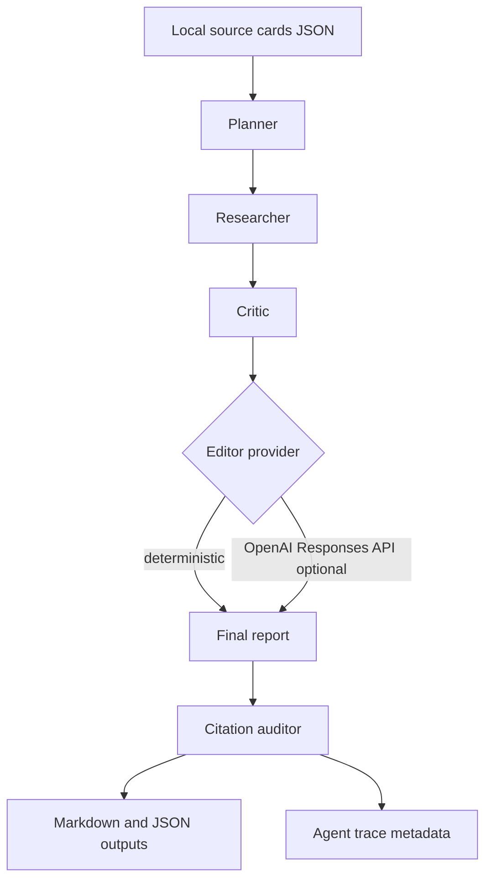

# Architecture

The diagram source is [architecture.mmd](architecture.mmd).

## The pipeline

The pipeline runs five agents in order:

- `planner`: validates the topic and source cards, then creates report sections
  with source IDs attached to each section.
- `researcher`: converts selected local source cards into section-level
  research notes.
- `critic`: checks the draft for blocking editorial issues, including claims
  without source support.
- `editor`: applies either a deterministic edit or an optional OpenAI editor
  pass that must preserve claim IDs and citation IDs.
- `citation-auditor`: verifies that final claims cite known source cards and
  flags missing, unknown, or unused citations.



## Source files

```text
src/
  agents.ts       agent-stage implementations
  citations.ts    citation audit logic
  cli.ts          command-line interface
  index.ts        public library exports
  pipeline.ts     provider resolution and pipeline orchestration
  providers.ts    deterministic/OpenAI provider setup
  render.ts       Markdown and JSON renderers
  text.ts         text formatting helpers
  types.ts        public TypeScript types
tests/            Vitest coverage for pipeline, CLI, rendering, and audits
.github/          CI and Dependabot configuration
.env.example      safe local configuration template
AGENTS.md         guidance for AI coding agents
```

## Continuous integration

GitHub Actions runs the workflow in
[`.github/workflows/ci.yml`](../.github/workflows/ci.yml) on every push and pull
request to `main`, using Node 24. The job runs, in order:

1. `npm ci`: clean dependency install.
2. `npm audit --audit-level=moderate`: fail on moderate or higher
   vulnerabilities.
3. `npm outdated`: surface outdated dependencies.
4. `npm run lint`: ESLint.
5. `npm run typecheck`: `tsc --noEmit`.
6. `npm test`: Vitest suite.
7. `npm run build`: compile to `dist/`.

Dependency updates are automated with Dependabot for both npm packages and
GitHub Actions (see [`.github/dependabot.yml`](../.github/dependabot.yml)).
